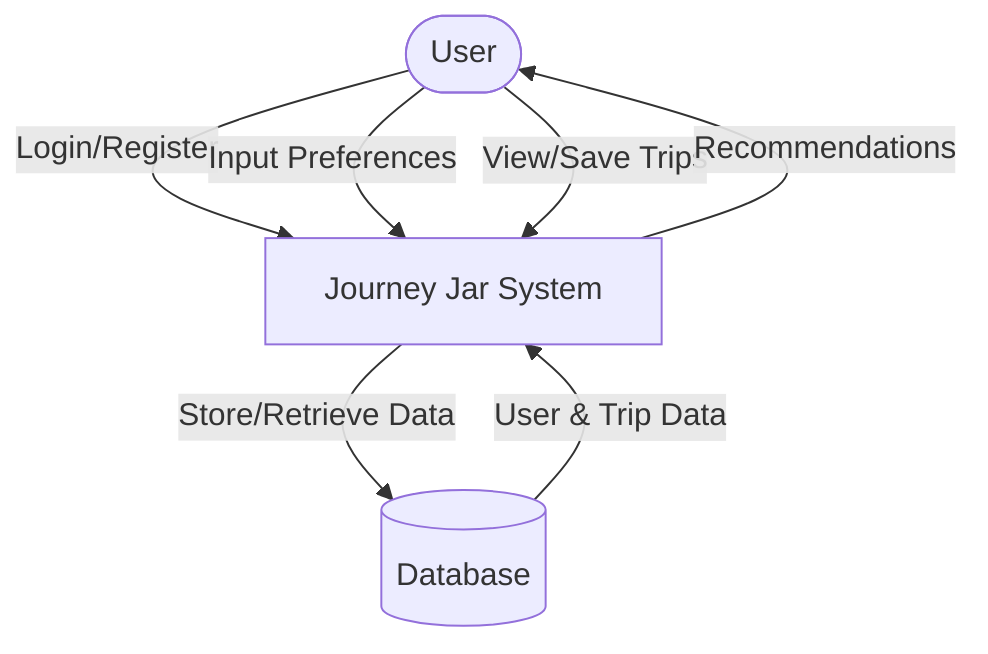
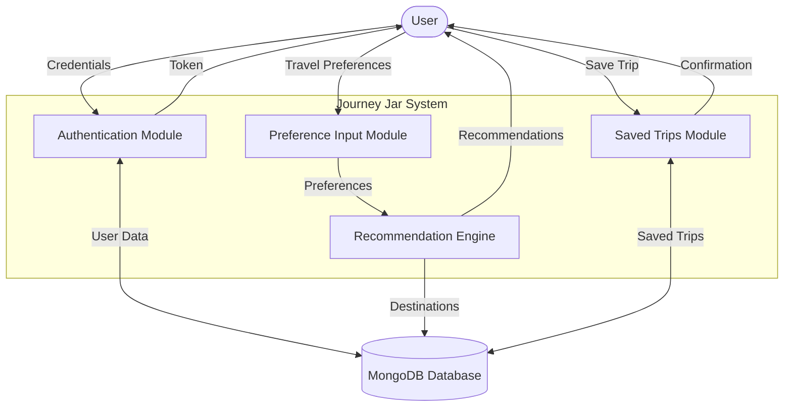
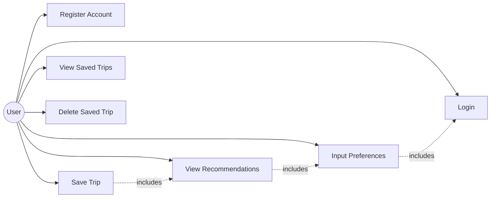
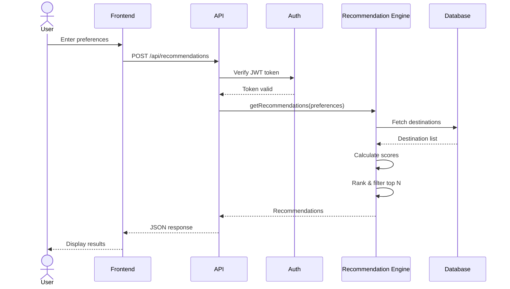
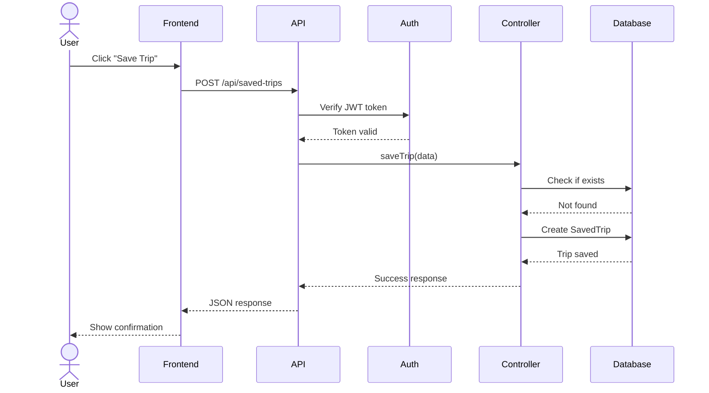
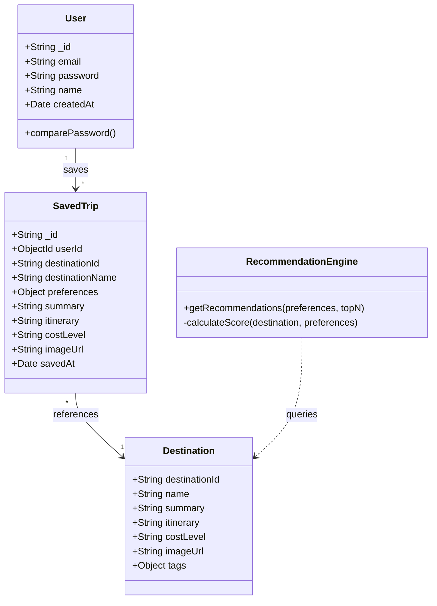
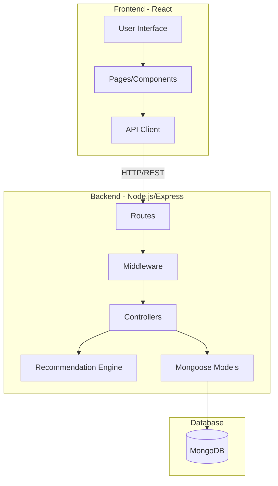

# Journey Jar - System Diagrams

## Level 0 DFD (Context Diagram)

## Level 1 DFD (Detailed Process Flow)

## Use Case Diagram

## Sequence Diagram - Get Recommendations

## Sequence Diagram - Save Trip

## Class Diagram

## Architecture Diagram

